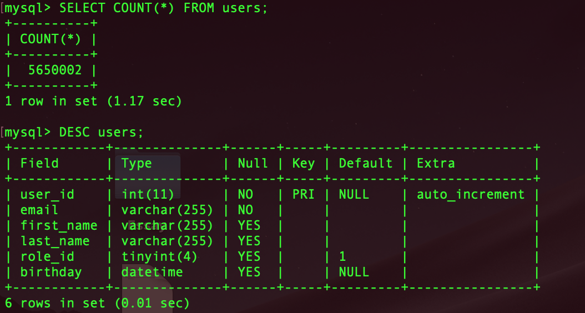
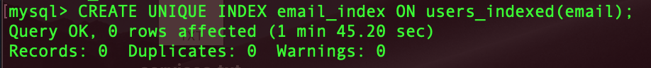
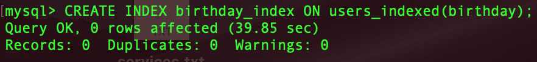
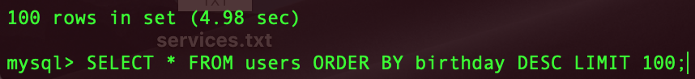
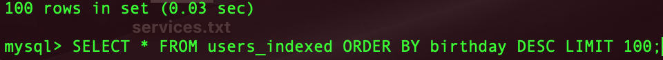
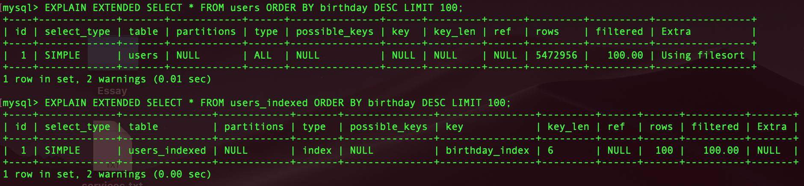

# MySql index test

To start you have to run:
> docker-compose up -d

and go to http://127.0.0.1 and generate dummy data for table.

Table size and structure:

Create email index:

Create birthday index:

Order by birthday:

Order by birthday with index:

Explain:
